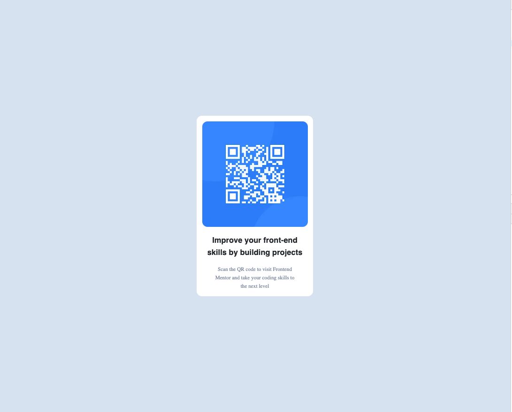

# Frontend Mentor - QR code component solution

This is a solution to the [QR code component challenge on Frontend Mentor](https://www.frontendmentor.io/challenges/qr-code-component-iux_sIO_H). Frontend Mentor challenges help you improve your coding skills by building realistic projects. 

## Overview

### Screenshot

### Links

- Preview URL: [Preview URL Deployed with Vercel](https://qr-code-component-sage-six.vercel.app/)

## My process

### Built with

- Semantic HTML5 markup
- CSS custom properties / Reactstrap
- CSS Grid
- NextJS - Pages Directory
- React
- Mobile-first workflow
- [React](https://reactjs.org/) - JS library
- [Next.js](https://nextjs.org/) - React framework
- [Styled Components](https://styled-components.com/) - For styles

